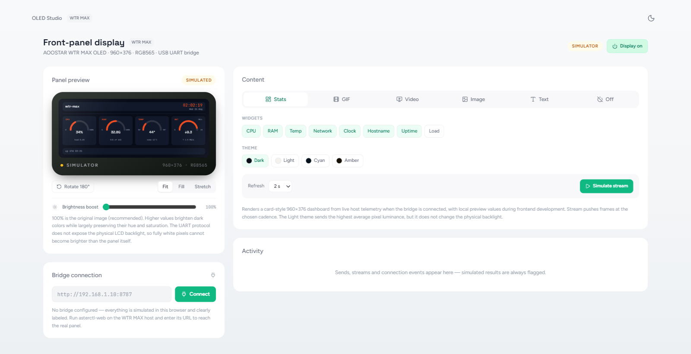
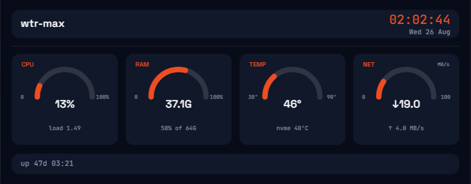

# AOOSTAR OLED Studio

A self-hosted web controller for the 960×376 front display in the AOOSTAR
WTR MAX and compatible systems. One Rust service hosts the OLED Studio UI,
collects Linux telemetry, and serializes every display command through a single
device worker.



## Features

- Live CPU, RAM, temperature, network, clock, hostname, and uptime dashboard
- Source-timed, continuously looping GIF playback
- Optional GIPHY search with a browser-local API key
- Local video and YouTube playback with selectable duration and looping
- Still images, styled text, rotation, fit modes, and a dedicated Off mode
- 100–200% RGB565 midtone boost without interrupting active playback
- Embedded frontend: the production service needs no separate web server
- Proxmox migration installer with dry-run, backup, rollback, and legacy-service replacement

### Native 960×376 panel render



## Proxmox installation

Download and verify a release ZIP on the Proxmox host, then run a no-change
preflight before installing:

```bash
sha256sum -c aoostar-oled-studio-proxmox-x86_64.zip.sha256
unzip aoostar-oled-studio-proxmox-x86_64.zip
cd aoostar-oled-studio-proxmox-x86_64
./verify-package.sh

sudo bash install-asterctl-web.sh --dry-run --purge-legacy \
  --device /dev/ttyACM0 --bind-address 192.168.1.10
sudo bash install-asterctl-web.sh --yes --purge-legacy \
  --device /dev/ttyACM0 --bind-address 192.168.1.10
```

Open `http://192.168.1.10:8787` from another computer on the same trusted LAN.
The API has no login, so do not forward port 8787 to the internet. See
[`linux/PROXMOX-INSTALL.md`](linux/PROXMOX-INSTALL.md) for migration, firewall,
rollback, and brightness-probe details.

## Development

Build the embedded frontend first, then run the Rust service in simulation:

```bash
cd oled-studio/source
bun install --frozen-lockfile
bun test
bun run build
cd ../..

cargo test --workspace
cargo run -p asterctl-web --release -- --simulate
```

Open <http://127.0.0.1:8787>. For frontend-only work, run `bun run dev` from
`oled-studio/source`; the UI automatically uses clearly labelled local
simulation data when no bridge URL is configured.

The frontend contract is documented in [`docs/API.md`](docs/API.md).

To assemble the Proxmox package, first fetch the pinned official Linux
`yt-dlp` helper and then run the package builder:

```powershell
pwsh scripts/Fetch-YtDlp.ps1
pwsh linux/New-ProxmoxPackage.ps1
pwsh linux/Test-ProxmoxPackage.ps1
```

## Brightness limitation

Brightness boost transforms RGB565 midtones in software. It can increase the
average perceived brightness of dark content, but it cannot raise the panel's
physical backlight or make an already-white pixel brighter.

## Project origin

OLED Studio, the web bridge, media pipeline, Proxmox migration tooling, and
packaging in this repository are maintained as an independent project. The
low-level `asterctl-lcd` protocol implementation is derived from
[`zehnm/aoostar-rs`](https://github.com/zehnm/aoostar-rs) and retains its
original copyright and dual MIT/Apache-2.0 licensing. See [`NOTICE.md`](NOTICE.md).

AOOSTAR is a trademark of its respective owner. This community project is not
an official AOOSTAR product.

## License

Unless a file states otherwise, the source is available under either the
[MIT License](LICENSE-MIT) or [Apache License 2.0](LICENSE-APACHE).
